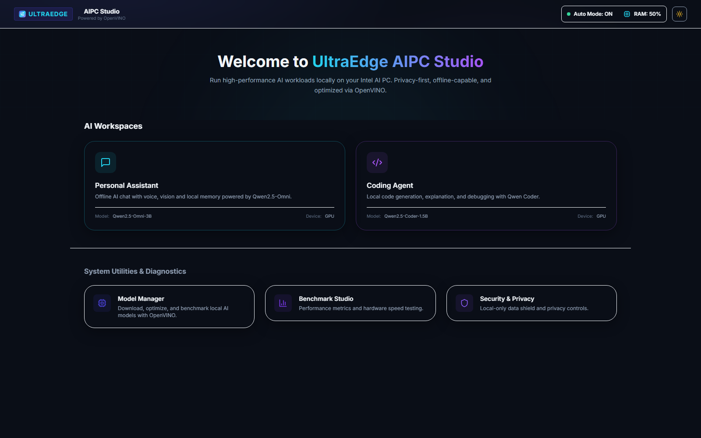
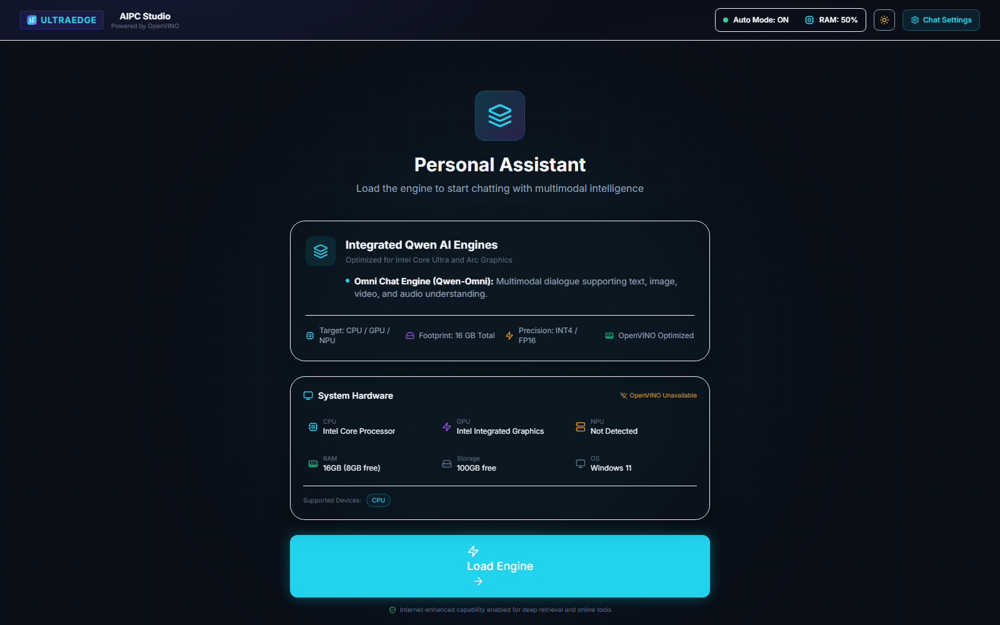
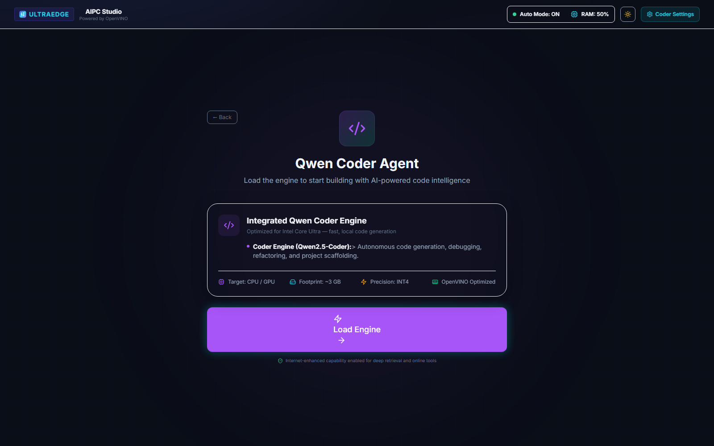
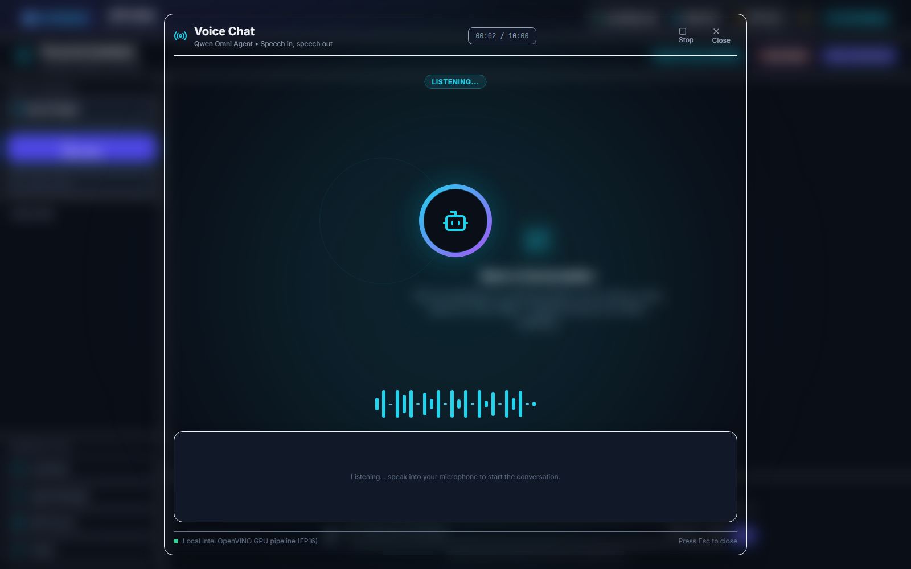
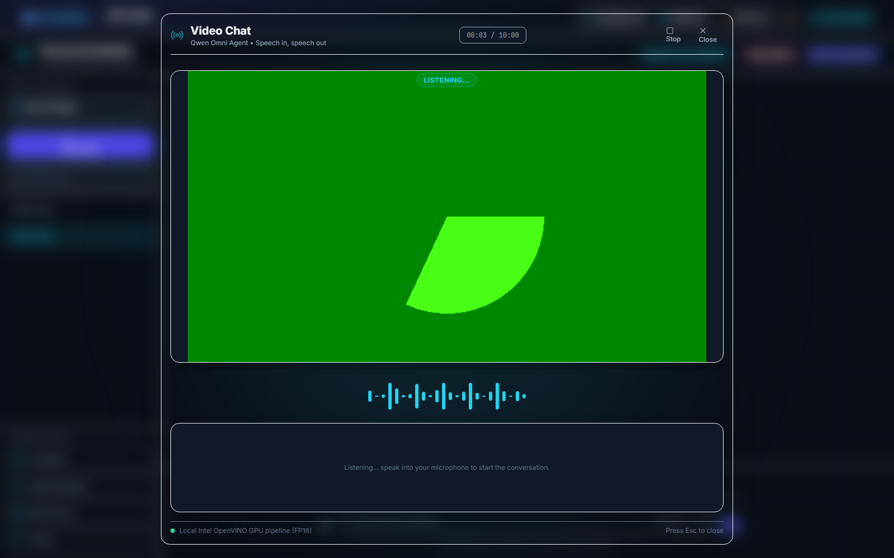
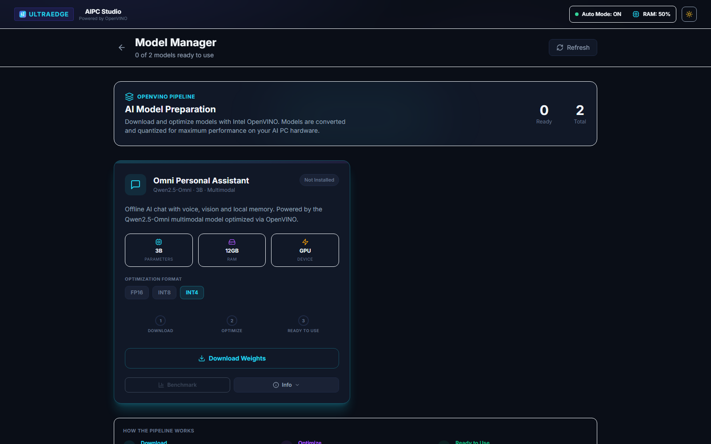
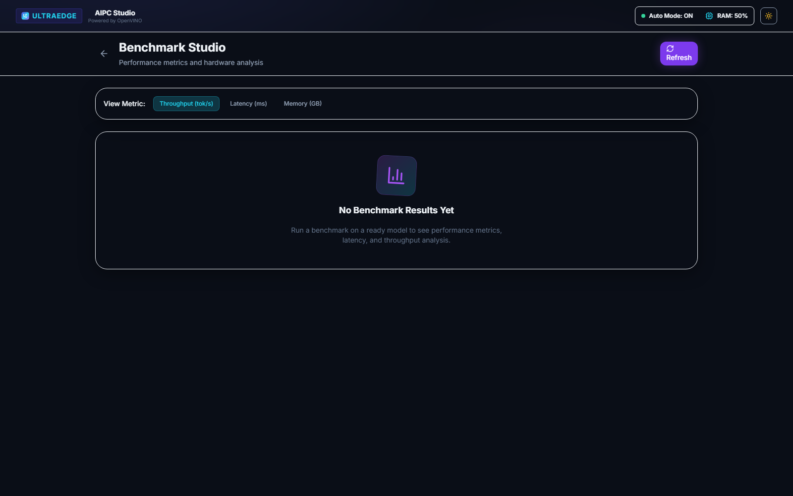
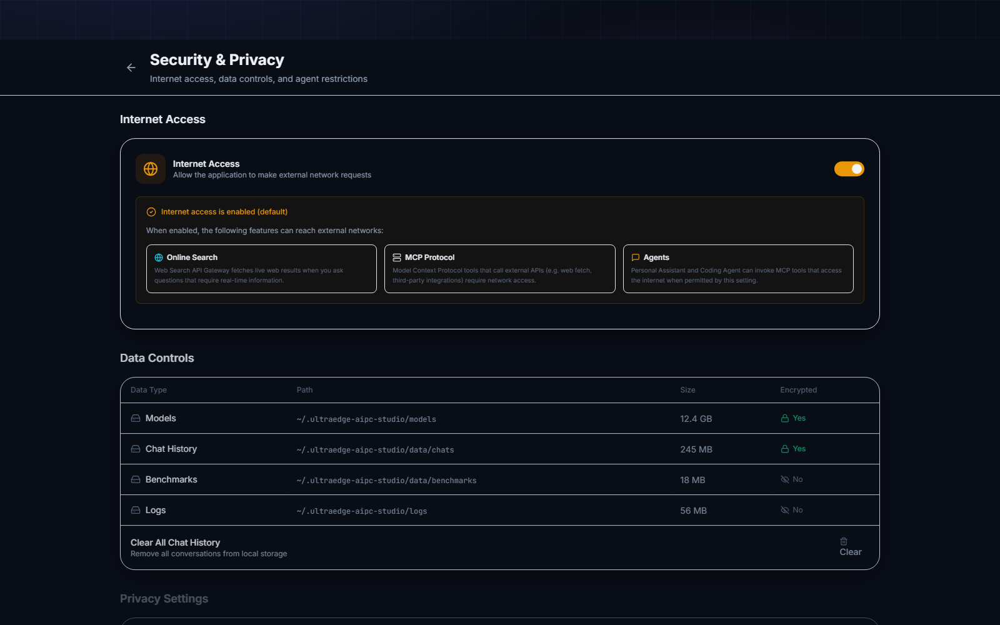

# UltraEdge AIPC Studio

[](https://github.com/open-source/UltraEdge-AIPC-Studio/actions/workflows/ci.yml)
[](doc/CHANGELOG.md)
[](https://www.python.org/)
[](https://nodejs.org/)
[](#operating-requirements)
[](LICENSE)

## Project status

- **Current state:** Alpha / active development
- **Supported platform:** Windows and Linux on Intel Core Ultra
- **License:** Apache License, Version 2.0
- **Project owner:** Nitin Mane, Intel Software Innovator

| Area | Status |
| --- | --- |
| Release maturity | Alpha; intended for development and evaluation |
| Development state | Active |
| Supported hosts | Windows and Linux on Intel Core Ultra systems |
| API and storage compatibility | Not yet guaranteed between revisions |
| Backend verification | Ruff and pytest workflows are provided |
| Frontend verification | ESLint, TypeScript, Vitest, and Vite build workflows are provided |
| Distribution | Source checkout; no production installer is currently supplied |
| Local code execution | Disabled by default and intended only for trusted development machines |

The status table describes the repository rather than a service-level
commitment. Consult the [change log](doc/CHANGELOG.md) for revision history and
the [security policy](SECURITY.md) before enabling developer capabilities.

UltraEdge AIPC Studio is a local-first development console for running and
evaluating AI workloads on Intel AI PCs. It provides model management,
OpenVINO inference, personal and coding assistants, speech and video
interfaces, runtime diagnostics, and benchmark facilities through a FastAPI
backend and a React frontend.

The project is under active development. Interfaces, model definitions, and
storage formats may change before a stable release.

## Operating requirements

| Component | Requirement |
| --- | --- |
| Processor | Intel Core Ultra processor; startup is refused on unsupported CPUs |
| Operating system | Windows or Linux |
| Python | Python 3.10 or later; CI currently uses Python 3.11 |
| Node.js | Node.js 20.19 or later with npm |
| Acceleration | Intel graphics and NPU drivers appropriate for the host |
| Memory and storage | Determined by the selected model; multimodal models require substantial capacity |

Intel macOS detection is present on a best-effort basis. Apple Silicon and
non-Ultra Intel processors are not supported.

## Principal functions

- Hardware suitability and OpenVINO device detection.
- Local model download, verification, conversion, loading, and cache
  management.
- Text, image, audio, and video interaction with supported Qwen models.
- A coding workspace with file browsing, editing, generation, and an optional
  local runtime executor.
- Token2Wav speech generation with latency-oriented and quality-oriented
  profiles.
- Runtime status, audit records, model benchmarks, and local chat history.
- Optional network tools for explicitly requested web operations.

Feature availability depends on the installed model, host drivers, operating
system, and available memory.

## User interface

The following images were captured from the current frontend development build
at a 1600 by 1000 pixel viewport. Hardware readings, model state, and available
devices will differ between installations.

### Main dashboard

The dashboard provides entry points for the assistant workspaces, model
management, benchmarks, and security controls.



### Personal Assistant

The Personal Assistant pre-load view reports the selected multimodal engine,
target devices, precision, memory expectations, and detected host hardware.



### Coding Agent

The Coding Agent pre-load view identifies the local coder model and its runtime
requirements before the editing workspace is opened.



### Audio Chat

The Audio Chat session keeps listening state, elapsed time, Stop and Close
controls, the speech waveform, and the conversation transcript within one
viewport.



### Video Chat

The Video Chat session combines the camera preview with speech state, session
controls, waveform, and transcript. The documentation capture uses Chrome's
synthetic camera source; an installed system displays the selected physical
camera instead.



### Model Manager

The Model Manager presents model availability, precision choices, hardware
requirements, download state, optimization stages, and benchmark actions.



### Benchmark Studio

Benchmark Studio reports throughput, first-token latency, memory use, and model
load time when measured results are available. The empty state is shown below.



### Security and Privacy

The Security and Privacy page groups network access, local data controls,
agent restrictions, and privacy settings for operator review.



## Quick start

The repository includes a cross-platform launcher. It performs the mandatory
processor check before installing frontend packages or starting either
service.

### First-time installation

Create and activate a Python virtual environment, then install the backend
requirements.

Windows PowerShell:

```powershell
python -m venv .venv
.\.venv\Scripts\Activate.ps1
python -m pip install --upgrade pip
python -m pip install -r backend\requirements.txt
```

Linux:

```bash
python3 -m venv .venv
. .venv/bin/activate
python -m pip install --upgrade pip
python -m pip install -r backend/requirements.txt
```

Install the frontend packages:

```bash
cd frontend
npm install
cd ..
```

### Start the application

From the repository root:

```bash
python start.py
```

The launcher starts the following local services:

| Service | Address |
| --- | --- |
| Backend API | `http://127.0.0.1:8000` |
| Frontend development server | `http://127.0.0.1:3000` |

Use `Ctrl+C` in the launcher terminal to stop both services.

Useful launcher options:

```bash
python start.py --check-only
python start.py --no-browser
python start.py --install-frontend
python start.py --help
```

`--check-only` reports hardware suitability without starting services.
`--install-frontend` forces `npm install` even when `node_modules` already
exists.

## Manual operation

Run the backend from its own directory so that its `.env` file is discovered
consistently:

```bash
cd backend
python -m app.main
```

In a second terminal:

```bash
cd frontend
npm run dev
```

The backend repeats the hardware suitability check during application startup.
Starting it directly does not bypass the Intel Core Ultra requirement.

## Configuration

Backend settings use the `ULTRAEEDGE_` environment-variable prefix. Copy
`backend/.env.example` to `backend/.env` when local overrides are required.

Important settings include:

| Setting | Default | Purpose |
| --- | --- | --- |
| `ULTRAEEDGE_HOST` | `127.0.0.1` | Backend bind address |
| `ULTRAEEDGE_PORT` | `8000` | Backend TCP port |
| `ULTRAEEDGE_CORS_ORIGINS` | Local frontend origins | Permitted browser origins |
| `ULTRAEEDGE_ENABLE_CODE_EXECUTION` | `false` | Enables local compiler and interpreter subprocesses |
| `ULTRAEEDGE_MODELS_DIR` | Project model directory | Overrides model storage |
| `ULTRAEEDGE_APP_DATA_DIR` | `backend/app_data` | Overrides database and generated-data storage |
| `ULTRAEEDGE_OV_CACHE_DIR` | `backend/app_data/ov_cache` | Overrides the OpenVINO cache |

Do not enable local code execution on an untrusted machine or expose the
backend to an untrusted network. The runtime executor is not an operating-system
sandbox.

## Architecture

The program is divided into three primary layers:

| Layer | Location | Responsibility |
| --- | --- | --- |
| Web client | `frontend/src` | React user interface and client-side state |
| API service | `backend/app/api` | Request validation and HTTP endpoints |
| Runtime services | `backend/app/runtime` | OpenVINO model loading, inference, speech, and tool dispatch |

SQLite persistence and repository code are under `backend/app/memory`.
Hardware checks are under `backend/app/hardware`. Model catalog, download, and
conversion code are under `backend/app/models`.

For additional detail, see [Architecture](docs/architecture.md) and the
[API reference](docs/api-reference.md).

## Data and network behavior

The backend binds to the loopback interface by default. Chat history, settings,
audit records, generated speech, and OpenVINO cache data are stored locally
under `backend/app_data` unless configuration overrides that location.

Local-first does not mean that the program is permanently disconnected from
the network. Network access occurs when an operator:

- installs Python or npm dependencies;
- downloads a model from Hugging Face;
- enables or invokes a web-search, exchange-rate, or URL-fetching tool; or
- configures a non-local service endpoint.

The project does not claim that ordinary SQLite files or model caches are
encrypted at rest. Protect the host account and storage volume accordingly.
See [Security Policy](SECURITY.md) for the complete security model.

## Development checks

Backend:

```bash
cd backend
python -m ruff check app tests
python -m pytest tests -v
```

Frontend:

```bash
cd frontend
npm run lint
npm test
npm run build
```

Some development tools, including Ruff, may need to be installed separately
from the runtime requirements.

## Documentation

- [Developer setup](docs/developer-setup.md)
- [Architecture](docs/architecture.md)
- [API reference](docs/api-reference.md)
- [Design system](docs/design-system.md)
- [Change log](doc/CHANGELOG.md)
- [Contributing](CONTRIBUTING.md)
- [Contributor agreement](CONTRIBUTOR_AGREEMENT.md)
- [Security policy](SECURITY.md)
- [Copyright and attribution notice](NOTICE)

## Project stewardship

UltraEdge AIPC Studio was created and is maintained by Nitin Mane, Intel
Software Innovator. Nitin Mane is the copyright owner and licensor of the
original project. The professional designation does not identify Intel
Corporation as the owner or licensor and does not imply Intel endorsement.

## License

Copyright 2026 Nitin Mane.

UltraEdge AIPC Studio is distributed under the Apache License, Version 2.0.
Users may access, use, study, modify, fork, and redistribute the project without
requesting permission, provided they comply with the license. See
[LICENSE](LICENSE) and [NOTICE](NOTICE).

Changes proposed for inclusion in the official project require prior
maintainer approval and signed acceptance of the
[Contributor Agreement](CONTRIBUTOR_AGREEMENT.md). This contribution policy
does not limit the rights granted to downstream users by Apache 2.0.
